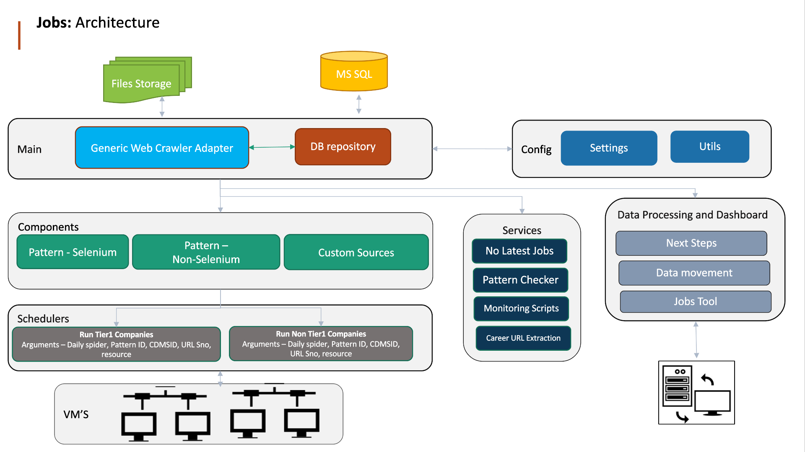

# 1. Jobs Analytics Automation Application
Scope : Automate Web site crawling and data extraction from public Domains 
Description : Crawling and extracting data from public domains and saving the data into our internal database. Preparing the dashboard and reports for Job analytics  

## 1.1 System Overview
it streamlines the process of gathering and analyzing job-related data. It begins with crawling various online sources to collect job information, followed by organizing the data into a structured format. The system then transforms the raw data to ensure accuracy and consistency, delivering it to the appropriate platforms for further analysis and reporting. This comprehensive approach provides valuable insights into the job market, helping organizations and individuals make informed decisions.  

## 1.1.1  Fields & Definations
`
CDMSID: A unique identifier for a particular company.
URLSNo: A unique identifier for a specific job URL associated with a company.
DailySpider: Refers to Tier1 (priority companies) and NonTier1 (non-priority companies).
CrawlStatus by URL:
	"YetToRun": Status code 0
	"Success": Status code 1
	"Failed": Status code 2
	"NoJobs": Status code 3
	"WIP" (Work In Progress): Status code 4
	"URLNotWorking": Status code 5
`
## 1.1.2  Crawling Fields
`
Job Title
Job URL
Job PostDate
Job Location
Job Description
`

## 1.2 Installation
Prerequisites 
1.Python 3.12 
2.Git Bash 
3.Editors like Sublime/Pycharm etc 
4.Chrome & Firefox Browsers Latest Version 
5.Postman 
6.Microsoft SQL Server SSMS 

## 1.3 Required Packages
beautifulsoup4
requests
scrapy
selenium

## 1.4 Source Code
Source Code: Bitbucket 
Production Branch : master 
Development Branch : dev 

## 1.5 Architecture and Workflow

Below is jobs crawling code workflow and it organizes various components essential for job analytics and data processing. It consists of modules for storage, common functionalities, configuration, component categorization, scheduling, virtual machine scheduling, specialized services, and data management. The structure aims to enhance reusability, streamline scheduling, and facilitate data processing and monitoring for efficient job analytics operations. 

File Storage(Media): The process starts with file storage, where all essential logs, CSV files, drivers, and executable files are kept. This central repository ensures that the necessary resources are available for the system's operations.  

### Main: 
The main section comprises reusable Python packages and modules for common functionalities, including database connectivity and CRUD (Create, Read, Update, Delete) operations. These modules are used across different components to perform basic system functions.  

### Config: 
Configuration settings are managed here, with reusable methods that support email functionalities and other general-purpose functions. This section provides standardized methods that can be accessed by other modules.  

### Components: 
Scripts are categorized based on their source and purpose. This includes pattern-based, non-pattern-based, and custom code solutions. These scripts are used to process different types of job data and apply specific transformations or checks.  

### Schedules: Scheduling scripts for different processing tiers, such as Tier 1 and non-Tier 1, are housed here. These scripts manage the timing and sequence of execution for various components.  

### VMS (Virtual Machine Scheduling): 
This section is responsible for controlling all the schedules, coordinating the execution of different tasks across multiple sections. It ensures that components are run at the correct times without conflicts.  

### Services 
The system offers custom services through scripts dedicated to tasks such as checking for the absence of the latest jobs, pattern recognition, monitoring, and extracting career URLs. These specialized services add value by addressing unique requirements.  

### Data Processing & Dashboard
Finally, the processed data is moved to the Job Analytics (JA) database, and dashboards are managed for monitoring. This section also includes monitoring tools to ensure data accuracy and system performance. 

## 1.6 Crawling Checks
1.	Data Flow Check by CDMSID
2.	Tier1 Crawling Data By CDMSID (Last 2 Phases)
3.	Non-Tier1 Crawling Data By CDMSID (Last 2 Phases)
4.	Tier1 CrawlStatus By Phase
5.	Tier1 JobCounts By Phase (Spike Check Report)
6.	Non-Tier1 JobCounts By Phase (Spike Check Report)
7.	Last Phase JobCounts Tier1
8.	Last Phase JobCounts Non-Tier1
9.	Active Crawling URLs
10.	Inactive Crawling URLs
11.	Max PostDate by CDMSID
12.	Pattern Companies Crawling Status - Dashboard - Tier1
13.	Pattern Companies Crawling Status - Dashboard - Non-Tier1
14.	Non-Pattern Companies Crawling Status - Dashboard - Tier1
15.	Non-Pattern Companies Crawling Status - Dashboard - Non-Tier1

## 1.7  How to run Scripts?
`python Patterns\BambooHRPattern.py`

## 1.8  How to check companies?
select * from [CareerPages].[dbo].[CP_Companies_LUTemp] where CDMSID=3396689 and Sno=113315

## 1.9  How to check crawl status by url sno?
select * from [CareerPages].[dbo].[CP_Tier1_CrawlStatus_LUTemp] where CDMSID=3396689 and URLSno=113315

## 1.10  How to check Company Jobs?
select * from [CareerPages].[dbo].[CP_Tier1_CrawlingEarth_LUTemp] where CDMSID=3396689 and URLSno=113315

## 1.11 How to check patterns?

select * from [CareerPages].[dbo].[CP_Patterns_Master] where CDMSID=3396689 and Sno=113315

## 1.12 Where to add ATS(Patterns) scripts?
`
goto project directory
cd jobsgenericwebcrawlerapp
cd Patterns
create file name {PatternName}Pattern.py in Patterns directory
`

## 1.13 Where to add NonATS(NonPattern or custom) scripts?
`
goto project directory
cd jobsgenericwebcrawlerapp
cd NonPatterns
create file name {PatternName}Pattern.py in NonPatterns directory
`

## 1.13 How to check Logs?
`
goto project directory
cd jobsgenericwebcrawlerapp
cd logs
Check blow log files
Tier1\*.log
NonTier1\*.log
`

